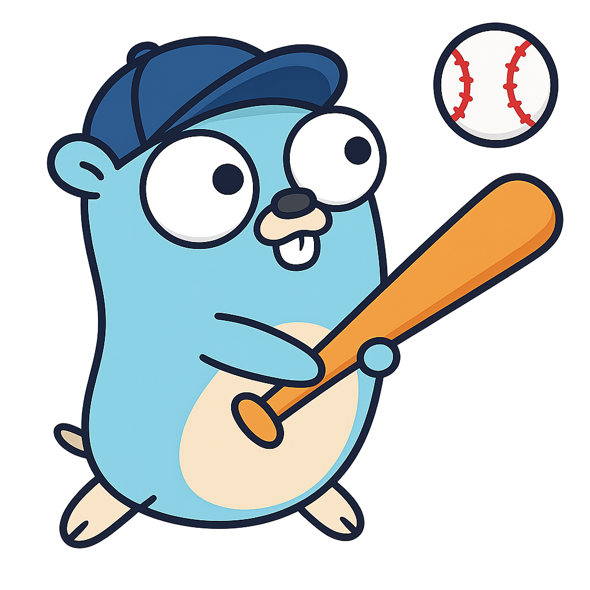

# ⚾ Go! Baseball API

<p align="center">
  
</p>

## Why this project exists

Baseball analytics often lacks the volume of pitch-by-pitch data needed for reliable insights. **Go! Baseball** simulates complete MLB games and exposes the results through a simple JSON API. Use it to generate thousands of realistic events for research, modeling, or just for fun.

## Run the server

Prerequisites:

- Go 1.21+
- PostgreSQL (connection configured in `config.ConnectDB()`)

```bash
go run main.go
```

The server listens on `PORT` (default `8080`) and prefixes every route with `/api/v1`.

## Endpoints

### `POST /api/v1/simulate`
Start an asynchronous simulation job.

Request body:
```json
{
  "userId": "your-user-id",
  "gamePk": 12345,
  "nSims": 1000,
  "outcomeMode": "agg" 
}
```
Response:
```json
{ "jobId": "<uuid>" }
```

### `POST /api/v1/status`
Check job status with a JSON body.

Request body:
```json
{ "userId": "your-user-id", "jobId": "<uuid>" }
```
Response:
```json
{
  "jobId": "<uuid>",
  "status": "pending|running|complete|failed",
  "currentSimulation": 500,
  "totalSimulations": 1000,
  "result": "optional message"
}
```

### `GET /api/v1/status`
Retrieve job status using query parameters. `userId` is required; `jobId` is optional. If `jobId` is omitted, the endpoint returns all jobs for the user.

### `GET /api/v1/results`
Pitch-by-pitch results for completed simulations. Supports many filters (e.g., `gamePk`, `batterid`, `pitcherid`, `velocityMin`, `exitVelocityMax`, `inning`, etc.) and returns up to 100 events per request.

### `GET /api/v1/agg-core`
Aggregated game totals. Filter by `gamePk` or `gamedate` (Pacific time) and optionally limit the number of rows.

### `GET /api/v1/batter-props`
Batter prop projections. Query parameters: `batterId`, `gamePk`, `gamedate`.

### `GET /api/v1/pitcher-props`
Pitcher prop projections. Query parameters: `pitcherId`, `gamePk`, `gamedate`.

## Contact

- Twitter: [@loganbanthony](https://twitter.com/loganbanthony)
- Website: [loganbanthony.com](https://loganbanthony.com)

  > ⚠️ **Note:** This project has been **decommissioned** and is no longer maintained as of August 2025.

## License

Distributed under the Unlicense License. See LICENSE for more information.
